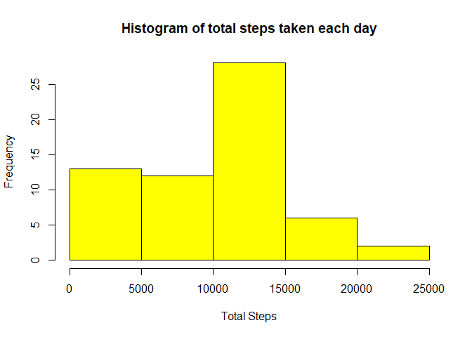
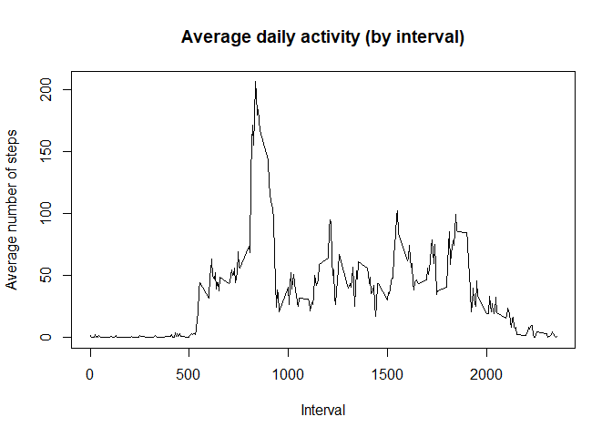
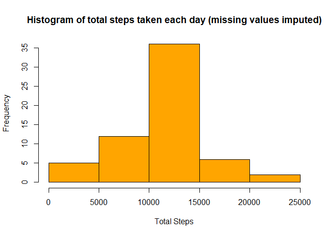
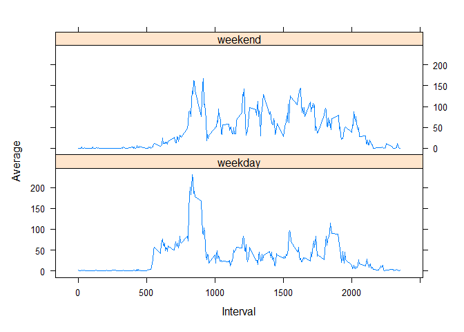

## Loading and preprocessing the data

Load the csv data into a variable.

```r
allStepData <- read.csv(unzip("activity.zip", "activity.csv"))
```

Update the column names.

```r
colnames(allStepData) <- c('Steps','Date','Interval')
```

Transform the date values from character to date.

```r
allStepData$Date <- as.Date(allStepData$Date, "%Y-%m-%d")
```

## What is mean total number of steps taken per day?

Calculate total steps per day.

```r
dailyStepTotal <- with(allStepData, setNames(aggregate(Steps, list(Date), sum, na.rm = TRUE), c("Date","Total")))
```

Plot histogram of total steps per day.

```r
hist(dailyStepTotal$Total, main = "Histogram of total steps taken each day", xlab = "Total Steps", 
     col = "yellow")
```

<!-- -->

Calculate mean and median number of steps taken each day.

```r
mean(dailyStepTotal$Total)
```

```
## [1] 9354.23
```


```r
median(dailyStepTotal$Total)
```

```
## [1] 10395
```


## What is the average daily activity pattern?

Calculate average steps per interval.

```r
intervalStepAverage <- with(allStepData, setNames(aggregate(Steps, list(Interval), mean, na.rm = TRUE),
                                                  c("Interval","Average")))
```

Plot time series showing the average daily activity pattern.

```r
plot(intervalStepAverage$Interval, intervalStepAverage$Average, type = "l", 
     main = "Average daily activity (by interval)", xlab = "Interval", ylab = "Average number of steps")
```

<!-- -->

Determine which 5-minute interval, on average across all the days in the dataset, contains the maximum number of steps.

```r
intervalStepAverage[which.max(intervalStepAverage$Average), ]$Interval
```

```
## [1] 835
```


## Imputing missing values

Calculate and report the total number of missing values in the dataset.

```r
sum(is.na(allStepData$Steps))
```

```
## [1] 2304
```

**Devise a strategy for filling in all of the missing values in the dataset**  
The strategy will be replacing missing values with the mean for that 5-minute interval.

Create a new dataset that is equal to the original dataset but with the missing data filled in.

```r
# Copy the original dataset into a new dataset
imputedStepData <- allStepData

# Create a summary of the mean steps for each interval
intervalAverages <- tapply(allStepData$Steps, allStepData$Interval, mean, na.rm = TRUE)

# Replace the NA values in the new dataset with the mean for that 5-minute interval
imputedStepData[with(imputedStepData, is.na(Steps)), ]$Steps <- intervalAverages
```

Make a histogram of the total number of steps taken each day after missing values are imputed.

```r
# Calculate total steps per day 
imputedStepTotal <- with(imputedStepData, setNames(aggregate(Steps, list(Date), sum),c("Date","Total")))

# Plot histogram of total steps per day after missing values are imputed
hist(imputedStepTotal$Total, main = "Histogram of total steps taken each day (missing values imputed)", 
     xlab = "Total Steps", col = "orange")
```

<!-- -->

Calculate mean and median total number of steps taken per day after missing values are imputed.

```r
mean(imputedStepTotal$Total)
```

```
## [1] 10766.19
```


```r
median(imputedStepTotal$Total)
```

```
## [1] 10766.19
```

**Do these values differ from the estimates from the first part of the assignment?**  
Both the mean and median values have increased as a result of imputing the missing values with the mean for that 5-minute interval.

**What is the impact of imputing missing data on the estimates of the total daily number of steps?**  
Imputing the missing data has resulted in an increase in the total daily number of steps.


## Are there differences in activity patterns between weekdays and weekends?

Create a new factor variable in the dataset indicating whether a given date is a weekday or weekend day.

```r
# Add new column to the dataset indicating which day of the week the date relates to
imputedStepData$Day <- weekdays(imputedStepData$Date)

# Replace the values in the new column with the corresponding weekday or weekend value
imputedStepData$Day <- ifelse(imputedStepData$Day %in% c("Saturday", "Sunday"), "weekend", "weekday")
```


Make a panel plot containing a time series plot (i.e. type = "l") of the 5-minute interval (x-axis) and the average number of steps taken, averaged across all weekday days or weekend days (y-axis).

```r
# Load required package
library(lattice)

# Calculate average steps per interval
imputedIntervalStepAverage <- with(imputedStepData, setNames(aggregate(Steps, list(Interval,Day), mean),
                                                             c("Interval","Day","Average")))

# Create panel plot
xyplot(Average ~ Interval | Day, data = imputedIntervalStepAverage, layout = c(1, 2), type = "l")
```

<!-- -->


